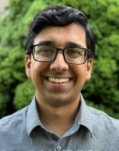
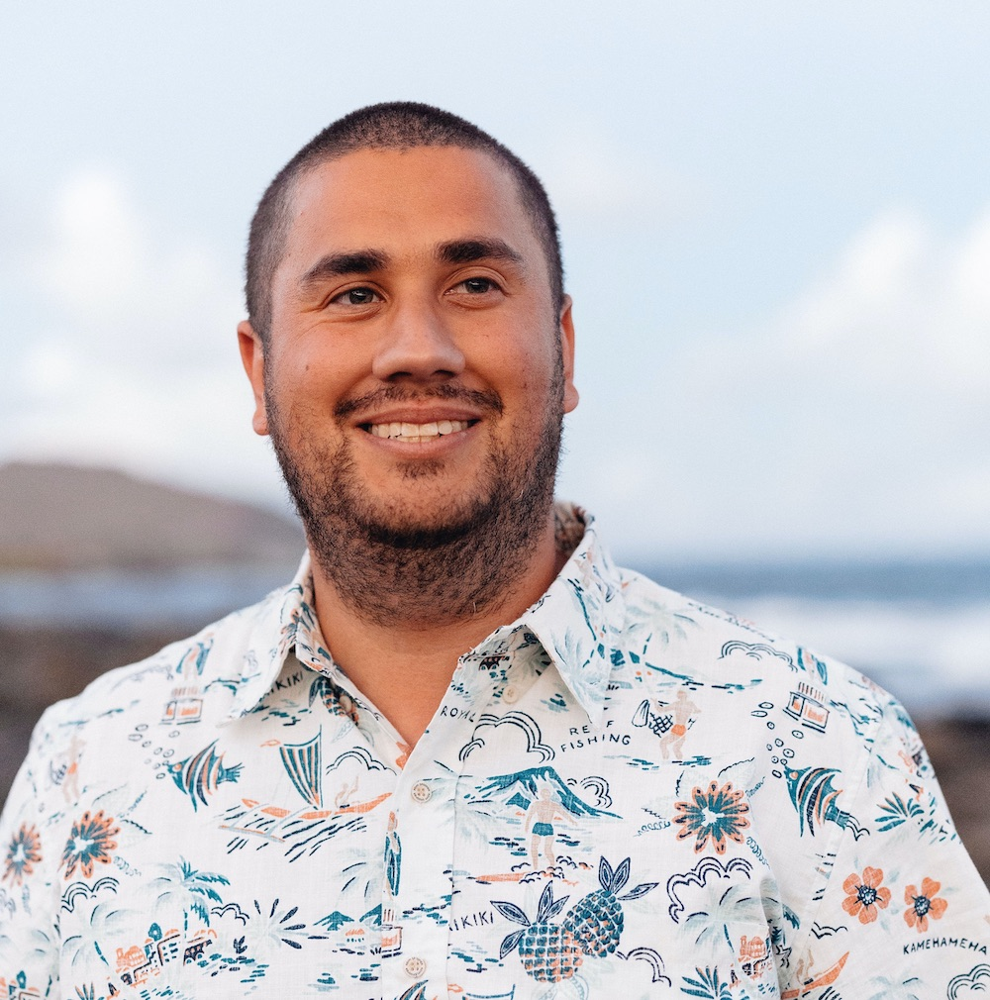
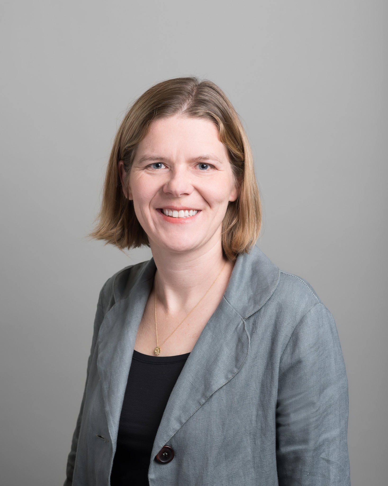

# SIGARCH Visioning Workshop on Sustainable Computing

## Description
As computing permeates every aspect of modern life—spanning data centers, mobile, and emerging technologies like AI and AR/VR—its environmental impact has surged. Computing now accounts for up to 4% of global energy and carbon emissions, rivaling the aviation industry. With demand for computing continuing to grow, energy consumption, resource extraction, and e-waste will escalate, amplifying sustainability challenges across the computing stack.

Beyond energy and carbon emissions, computing’s footprint extends to water-intensive semiconductor fabrication, rare metal extraction, and the mounting issue of electronic waste. Moreover, carbon emissions are shifting from operational energy consumption to hardware manufacturing, driven by efficiency optimizations and increasing fabrication complexity. Sustainable computing demands holistic solutions—optimizing across hardware life cycles, system design, and energy sources—to mitigate its environmental toll while meeting future computational needs.

## Conference Schedule

| Time            | Speaker             | Title                                       | Affiliation                         |
|----------------|---------------------|---------------------------------------------|--------------------------------------|
| 8:30 - 9:00am  |                     | Coffee                                      |                                      |
| 9:00 - 9:45am  | Udit Gupta          | Sustainable Computing: Implications, Opportunities, and Challenges                |   Cornell Tech                        |
| 9:45 - 10:30am | Lieven Eeckhout     | Computer System Sustainability: Trends and Modeling                                            |   Ghent University                   |
| 10:30 - 11:00am|                     | Coffee                                      |                                      |
| 11:00 - 11:45am| Shaolei Ren         | What Are We Overlooking for Sustainable Computing? | University of California, Riverside |
| 11:45 - 12:30pm| Anne-Laure Ligozat  | How Green is AI? Measuring AI's environmental footprint                                            |   ENSIIE and LISN                    |
| 12:30 - 2:00pm |                     | Lunch                                       |                                      |
| 2:00 - 2:45pm  | Maxine Pelcat       | The Pivotal Role of Circular Economy in Sustainable Electronics                                            |  National Institute of Applied Sciences (Rennes, France)                                    |
| 2:45 - 3:30pm  | Akshitha Sriraman   | TBA                                            | Carnegie Mellon University (Remote talk)                          |
| 3:30 - 4:00pm  |                     | Coffee                                      |                                      |
| 4:00 - 4:45pm  | Babak Falsafi       | Sustainibility in Datacenters: Measured not Guessed                                            | EPFL, EcoCloud, Swiss Datacenter Efficiency Association                             |
| 4:45 - 5:30pm  | David Patterson     | How to Give AI a Bad Carbon Footprint                                            | UC Berkeley, Google (Remote talk)                          |
| 5:30 - 5:45pm  | Udit Gupta          | Closing Remarks                            |                                      |

---

## Speakers

| Speaker |  Bio |
| ------------- | :------------- |
| [Lieven Eeckhout](https://users.elis.ugent.be/~leeckhou/) | Lieven Eeckhout (PhD 2002) is a Full Professor at Ghent University, Belgium, in the Department of Electronics and Information Systems (ELIS). His research interests include computer architecture, with specific emphasis on performance evaluation and modeling, dynamic resource management, CPU/GPU microarchitecture, and sustainability. He is the recipient of the 2017 ACM SIGARCH Maurice Wilkes Award and the 2017 OOPSLA Most Influential Paper Award, and he was elevated to IEEE Fellow in 2018 and ACM Fellow in 2021. |
| [Shaolei Ren](https://shaoleiren.github.io/) | Shaolei Ren is an Associate Professor of Electrical and Computer Engineering at the University of California, Riverside. His research broadly focuses on AI for Good, including efficient AI and decision-making to address societal challenges such as sustainability and public health. His work has influenced AI policies adopted by international organizations and governments such as the United Nations, UNESCO, WHO, and driven industry innovations such as the first real-time water footprint reporting tool for computing. He is a recipient of the NSF CAREER Award (2015) and several paper awards, including at ACM e-Energy (2024, 2016) and IEEE ICC (2016). He earned his Ph.D. from the University of California, Los Angeles. |
| [Anne-Laure Ligozat](https://perso.limsi.fr/annlor/) | Anne-Laure Ligozat is a computer science professor in the Paris region, in France. Her research topics address environmental impacts of digital technologies, with a focus on Artificial Intelligence. |
| [Maxime Pelcat](https://mpelcat.github.io/) | Maxime Pelcat (PhD 2010) is a Full Professor at INSA Rennes and holds a research appointment at the Institute of Electronics and Digital Technologies (IETR). His research interests include embedded systems design with novel constraints : security, intelligence and sustainability. He is the recipient of the Chaire d’Excellence France-Nokia 2024 and co-creator of the Sustainable Computing Workshop. |
| [Akshitha Sriraman](https://users.ece.cmu.edu/~asrirama/) | Akshitha Sriraman is an Assistant Professor at Carnegie Mellon University. Her research bridges computer architecture and systems software, with a focus on making hyperscale data centers more sustainable and equitable (via solutions that span the systems stack). Sriraman’s solutions have been deployed on real hyperscale systems and serve billions of users, saving millions of dollars and meaningfully reducing the global carbon footprint. Her research has been recognized with an NSF CAREER Award, the 2024 George Tallman Ladd Research Award, the 2023 Intel Rising Star Award, the 2022 ACM SIGARCH/TCCA Outstanding Dissertation Award HM, the 2022 ACM SIGOPS Dennis M. Ritchie Doctoral Dissertation Award HM, the 2022 BenchCouncil Distinguished Dissertation Award, the 2021 David J. Kuck Dissertation Prize, the 2021 ProQuest Distinguished Dissertation Award, a Meta Systems Research Award, and two IEEE Micro Top Picks distinctions. Sriraman completed her Ph.D. in Computer Science and Engineering at the University of Michigan. |
| [Babak Falsafi](https://parsa.epfl.ch/~falsafi/) | Babak Falsafi is a Professor in the School of Computer and Communication Sciences, the founding president of Swiss Datacenter Efficiency Association (SDEA) an industrial/academic consortium certifying full-stack efficiency and emissions in datacenter operation, and the founder of EcoCloud, a research center at EPFL investigating sustainable information technology since 2012. He has made numerous contributions to cloud-native technologies including a workload-optimized CPU design that laid the foundation for the first generation of Cavium ARM server CPUs, ThunderX. He is a recipient of an Alfred P. Sloan Research Fellowship, and a Fellow of ACM and IEEE. |
| [David Patterson](https://www2.eecs.berkeley.edu/Faculty/Homepages/patterson.html) | David Patterson is a UC Berkeley Pardee professor emeritus and a Google distinguished engineer. His most influential Berkeley projects likely were RISC and RAID His best-known book is Computer Architecture: A Quantitative Approach. He and his co-author John Hennessy shared the 2017 ACM A.M Turing Award and the 2022 NAE Charles Stark Draper Prize for Engineering. The Turing Award is often referred to as the “Nobel Prize of Computing” and the Draper Prize is considered a “Nobel Prize of Engineering.” |

## Venue

- Conference: This visioning workshop is co-located with [ASPLOS 2025](https://www.asplos-conference.org/asplos2025/) and [EuroSys 2025](https://2025.eurosys.org/) in Rotterdam, Netherlands.
- Room: Tokyo Room
- Date: March 30, 2025
- Time: 8:30am - 5:45pm 

## Contact us
For any further questions please contact <ugupta@cornell.edu>.

## About us

|  |  Organizer |
| ------------- | :------------- |
|  | **Udit Gupta** (Cornell Tech) is an Assistant Professor in Electrical and Computer Engineering at Cornell Tech. |
|  | **Josiah Hester** (Georgia Tech) is an Associate Professor of Interactive Computing and Computer Science at Georgia Tech. |
|  | **Bobbie Manne** (AMD) is Senior Fellow at AMD. |
|  | **Natalie Enright Jerger** (University of Toronto) is Professor of Electrical and Computer Engineering at University of Toronto. |

