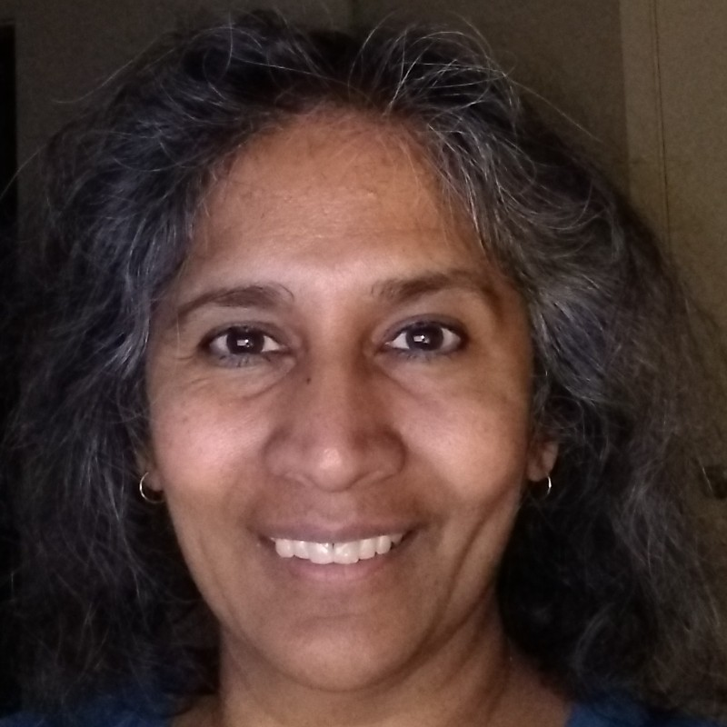

# SIGARCH Visioning Workshop on Sustainable Computing

## Description
As computing permeates every aspect of modern life—spanning data centers, mobile, and emerging technologies like AI and AR/VR—its environmental impact has surged. Computing now accounts for up to 4% of global energy and carbon emissions, rivaling the aviation industry. With demand for computing continuing to grow, energy consumption, resource extraction, and e-waste will escalate, amplifying sustainability challenges across the computing stack.

Beyond energy and carbon emissions, computing’s footprint extends to water-intensive semiconductor fabrication, rare metal extraction, and the mounting issue of electronic waste. Moreover, carbon emissions are shifting from operational energy consumption to hardware manufacturing, driven by efficiency optimizations and increasing fabrication complexity. Sustainable computing demands holistic solutions—optimizing across hardware life cycles, system design, and energy sources—to mitigate its environmental toll while meeting future computational needs.

## Conference Schedule

| Time            | Speaker             | Title                                       | Affiliation                         |
|----------------|---------------------|---------------------------------------------|--------------------------------------|
| 8:30 - 9:00am  |                     | Coffee                                      |                                      |
| 9:00 - 9:45am  | Udit Gupta          | Sustainable Computing: Implications, Opportunities, and Challenges                |   Cornell Tech                        |
| 9:45 - 10:30am | Lieven Eeckhout     | Computer System Sustainability: Trends and Modeling                                            |   Ghent University                   |
| 10:30 - 11:00am|                     | Coffee                                      |                                      |
| 11:00 - 11:45am| Shaolei Ren         | What Are We Overlooking for Sustainable Computing? | University of California, Riverside |
| 11:45 - 12:30pm| Anne-Laure Ligozat  | How Green is AI? Measuring AI's environmental footprint                                            |   ENSIIE and LISN                    |
| 12:30 - 2:00pm |                     | Lunch                                       |                                      |
| 2:00 - 2:45pm  | Maxine Pelcat       | The Pivotal Role of Circular Economy in Sustainable Electronics                                            |  National Institute of Applied Sciences (Rennes, France)                                    |
| 2:45 - 3:30pm  | Akshitha Sriraman   | TBA                                            | Carnegie Mellon University (Remote talk)                          |
| 3:30 - 4:00pm  |                     | Coffee                                      |                                      |
| 4:00 - 4:45pm  | Babak Falsafi       | Sustainibility in Datacenters: Measured not Guessed                                            | EPFL, EcoCloud, Swiss Datacenter Efficiency Association                             |
| 4:45 - 5:30pm  | David Patterson     | How to Give AI a Bad Carbon Footprint                                            | UC Berkeley, Google (Remote talk)                          |
| 5:30 - 5:45pm  | Udit Gupta          | Closing Remarks                            |                                      |

---

For more details on speaker bios and topics, please refer to the conference website.

## Contact us
For any further questions please contact <ugupta@cornell.edu> .

## About us

|  |  Organizer |
| ------------- | :------------- |
|  | **Udit Gupta** (Cornell Tech) is an Assistant Professor in Electrical and Computer Engineering at Cornell Tech. |
|  | **Josiah Hester** (Georgia Tech) is an Associate Professor of Interactive Computing and Computer Science at Georgia Tech. |
|  | **Bobbie Manne** (AMD) is Senior Fellow at AMD. |
|  | **Natalie Enright Jerger** (University of Toronto) is Professor of Electrical and Computer Engineering at University of Toronto. |

